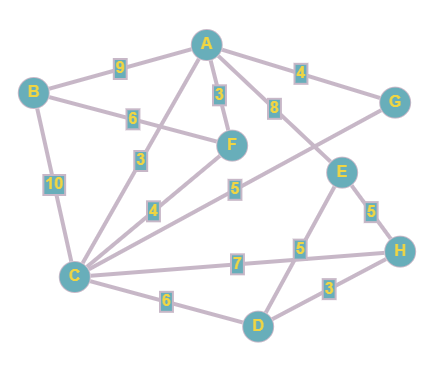

Os agentes A,B,C,D,E,F,G e H são conspiradores políticos. De forma a coordernar seus esforços, é vital que cada agente seja capaz de comunicar-se direta ou indiretamente com todos os outros conspiradores. Esta comunicação, contudo, envolve um certo risco para cada um. Os fatores de risco associados à comunicação direta entre cada par de conspiradores é dado por:

Todas as comunicações indiretas são impraticáveis pois exporiam todos os esquemas de disfarce. Qual é o menor risco total envolvido neste sistema de conexão, ou seja, o menor risco para que uma mensagem seja repassada para todos os conspiradores?